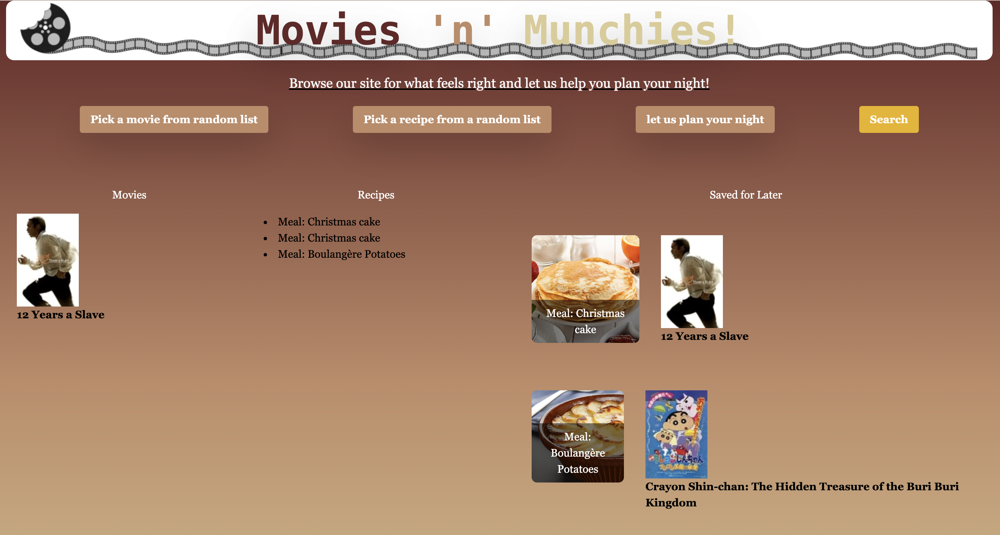

# Movies-Munchies

## Description
*Browse our site for what feels right and let us help you plan your night!*

Movies-n-Munchies is your one-stop shop to building the ultimate movie night! We decided to make this application because we all love watching movies and eating food. We wanted to build a project that could help make it easier to plan those nights! The goal of the project was to solve that problem of "Hey, what do you want to eat tonight?" "oh I don't care just make whatever and I'll complain about it later." This project taught us a lot about how to make a web application and how to work with APIs.

## Usage
To use the website simply search up whatever movie you want to watch and it will pair you up with a delicious recipe to make along with it! Or do it the other way around to find a great movie to watch with a food you're going to eat. You can also let us choose your night for you by simply pressing the random buttons for your movie or your recipe!

## Credits

### Collaborators
Tish Parry (Project Manager) | github: [tishthegoat](https://github.com/tishthegoat) 
Karina Gonzalez | github: [2023kgl](https://github.com/2023kgl) 
Charlie Dalton | github: [8bitCharlie](https://github.com/8bitCharlie) 
Charles Wilson | github: [CharlesRWilson](https://github.com/CharlesRWilson) 

### APIs Used
TheMealDB (https://www.themealdb.com/api.php) 
TMDB (https://developer.themoviedb.org/reference/search-movie)

Deployed: https://tishthegoat.github.io/Movies-n-Munchies/
GitHub repo : https://github.com/tishthegoat/Movies-n-Munchies

